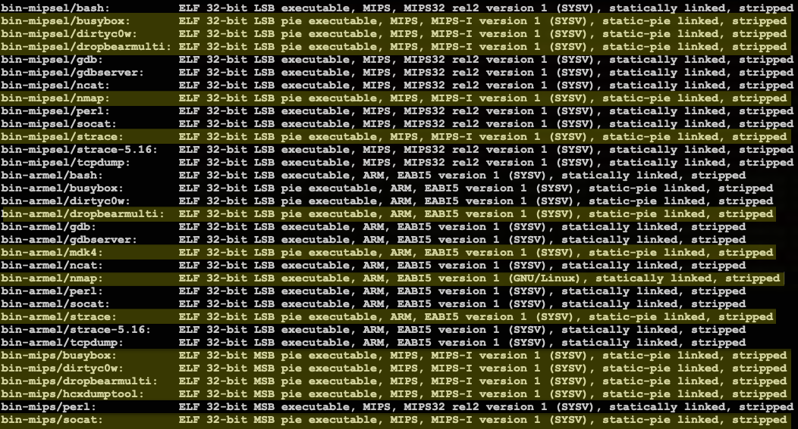

# Nokia Superuser Tools
### Scripts, binaries and guide for finding, rooting, and bypassing security protocols to maintain persistent access to Nokia ONT devices.  

vulnerable models \(known\):  G-0425G-A, G-0425G-B, G-120W-F, G-140W-C, G-140W-G, G-140W-H, G-1425G-A, G-1425G-B, G-240W-A, G-240W-C, G-240W-F, G-240W-G, G-240W-J, G-2425G-A, G-2425G-B, G-2426G-A.

## OVERVIEW

This repo has been divided into three sections:

-*Targeting*: finding vulnerable devices exposed to WAN

-*Exploitation*: unpacking, rewriting, and repacking the configuration files from target devices to allow root access over SSH as well as decrypting user passwords contained within those files
    
-*Post-exploitation*: adding software to exploited devices and changing internal settings to maintain remote root access

Everything in the first two sections runs on your device, everything in the third section \(except for the top-level scripts `make_tarball.sh` and `file_transfer.sh`\) runs on the target device.

Any distribution of GNU/Linux or another Unix-like OS should work fine, as long as the requirements have been previously built and are located somewhere along the user's $PATH. `setup-links.sh` will create symlinks to the executable scripts from this repo in `$HOME/.local/bin`, and `setup-dependencies.sh` will automatically download and build anything missing from source. 

Inn *Post-exploitation*, you will find architecture-specific binaries of various tools depending on what we have been able to provide thus far. The image below shows the current (as of 30 Aug 2025) binaries available:

The highlighted entries were built for this project and compiled against the Musl C library to ensure the smallest file size possible, using toolchains for mips-linux-muslsf, mipsel-linux-muslsf, and arm-linux-musleabi. The non-highlighted entries come from the [Medusa Embedded Toolkit](https://github.com/CyberDanube/medusa-embedded-toolkit).
 
The script used to modify the configuration, `nokia-use-ip-cfg` \(itself a modified version of [this script](https://gist.githubusercontent.com/rajkosto/e2b2455d457cc2be82dbb5c85e22d708/raw/f851ccbfe0c2466e21e48e5fafe639c0dd0f2eba/nokia-router-cfg-tool.py) \)will tell you the endianness of the device it came from. If it says it's big endian, it can only be MIPS. The script `nokia-xml-editor` will look for the device name, and you can check that against the file `nokia_cpu_list.txt`, or simply log in once the device is exploited and run `cat /proc/cpuinfo`. 

Tbe code for dirtyc0w has been included and comes from [here.](https://raw.githubusercontent.com/dirtycow/dirtycow.github.io/refs/heads/master/dirtyc0w.c) The following links contain source code for compiled binaries included in this project:

[Busybox](https://github.com/mirror/busybox)

[Dropbear](https://github.com/mkj/dropbear)

[Nmap](https://github.com/nmap/nmap)

[Hcxdumptool](https://github.com/ZerBea/hcxdumptool)

[Mdk4](https://github.com/aircrack-ng/mdk4)

[Perl](https://github.com/Perl/perl5)

[Socat](http://www.dest-unreach.org/socat/download/socat-1.8.0.3.tar.gz)

[Strace](https://github.com/strace/strace)

[Tcpdump](https://github.com/the-tcpdump-group/tcpdump)

## HOW IT WORKS 

The usual method for configuring these devices is through an HTTP interface, served locally over port 80, but frequently exposed to the WAN as well, over either port 443 \(https\) or port 8080. Typically, the ISPs that install these allow their end users access with the limited account "userAdmin" using the same password as the default PSK for their wifi. End users are not informed, however,  of the hard-coded login credentials for the superuser account, but these are easily found through a Google search and rarely have been changed. Login as _AdminGPON_ with password _ALC#FGU_.

There are exceptions, but these exceptions typically do little for the overall security of these devices. For instance, Telmex ONTs have only one account, "TELMEX", with the privileges of the AdminGPON account. This account also uses the wifi password as the default login password, making these devices less easily accessed if discovered exposed to the WAN. However, they come with WPS enabled by default, and their WPS instance is vulnerable to PixieDust, making accessing the network and finding the superuser password trivial for an attacker with proximity to the device.

The configuration files for these devices can be saved on the page "Backup and Restore" or simply by appending either `usb.cgi?backup` for the page containing the import/export buttons, or `usb.cgi?export` to directly download the file. This file, "config.cfg", can be easily decrypted to a readable .xml file, which contains many configuration options not available on any page of the standard HTTP interface. The most important of these are the ones that allow access via SSH, and bypass the "vtysh" shell, allowing direct access to /bin/sh. Reupload of the configuration file causes the ONT to reboot, taking it offline for a few minutes. Once back online, SSH will be served either on port 22 or \(more commonly\) on port 8022. Credentials to login are ONTUSER:admin. 

For the zoomeye script, you must also register a free account on zoomeye. We are not promoting their service nor do we have any relationship with zoomeye, paid or otherwise. We encourage you to use any similar service you like to search for vulnerable devices using the same or similar parameters.   

For devices located in Spanish-speaking countries,  "GPON Home Gateway" may be substituted with "Terminal Óptica".  Port 443 is the most common for serving the login page over WAN, however some examples have been found at port 8080 as well. jQuery 1.12 is the version most commonly associated with firmware that allows access with default credentials AdminGPON:ALC#FGU, however this may not work with every device you find that uses this version of jQuery. By the same token, some devices running newer versions may still contain these hardcoded credentials. 

For whatever reason, zoomeye, shodan, and other IOT device search engines may find one vulnerable device but fail to find more in the same IP subnet. The idea behind ip-range-scan.sh is to check these subnets to see if any other Nokia routers have their login pages exposed. Typically, if the hardcoded credentials work on one of them, they will work on all \(or almost all\) of the devices installed by the same ISP.  

## EXPLOITATION

Once authentication on a vulnerable device is achieved and the config.cfg file has been saved to the standard download directory, `autopwn.sh` or its symlink `nokia-autopwn` can be used to unpack, modify, and repack this file in a matter of seconds. You should execute `nokia-autopwn` by following it with the device's IP address, or another name that will help you remember where it came from. This script will move config.cfg to the directory `$HOME/nokia-cfgs` with whatever name you have passed to `nokia-autopwn` and the suffix .cfg, along with two other files: the XML file output from decryption, and the repacked config with -dropbear appended to its name. It then copies the modified file to your download directory, saving it as "dropbear". Uploading this file to the device will allow you root access via SSH.

`decrypt-all.sh` should probably be called something else as the  "encryption" used for sensitive values in many of the .xml files is really more of an encoding than true encryption. More to the point, this script allows you to quickly strip out all of the values that Nokia deemed sensitive and view them in plain text. If no such "encryption" is used, then `print-all.sh` can be used to quickly display these strings. Those familiar with UNIX-based systems will recognize the occasional use of values that have been *actually* encrypted with one-way hashing algorithms \(identifiable by their format beginning with a number between 1 and 5 followed by $ and a string of 32 or 64 characters\). If you wish to decrypt such values, we recommend using hashcat. 

Although `nokia-xml-editor` sets the standard SSH port of 22 for incoming connections, iptables rules present on the vast majority of vulnerable devices will only allow connections to SSH over WAN using port 8022. For LAN-accessible devices, port 22 should work with no issues.  After uploading the altered config file to the target, it will reboot, and it will take a few minutes \(longer for PPPOE devices\) for it to come back online. Once the device is back online, access with the `nokia-connect` script, using the IP address and port as arguments 1 and 2.

## POST-EXPLOITATION 

The two most common architectures for these SoCs are MIPS little endian (mipsel-linux-uclibc\) and ARM 32-bit soft float \(arm-linux-gnueabi\), typically MIPS 1004k and ARMv7l \(Cortex9, no hard float\).

Consequently, mipsle and armel have taken priority for static cross-compilation. There are binaries included for MIPS big endian, but fewer of them. This is also due to MIPS big endian no longer being a target for nearly any GNU/Linux distro, making building and testing using qemu and a chroot more difficult than it is for mipsel/armel. dirtyc0w, fortunately, is available for all architectures.

Even the unrestricted shell has some restrictions -- at first. These devices run a variety of Linux kernels - 3.4.19, 3.18.21, 4.1.45 have all been observed - but what all of them have in common is vulnerability to a race condition in copy-on-write, exploited as `dirtyc0w`. This allows changes to read-only files stored on the root squashfs filesystem  \(although these changes will not persist after a reboot\).
  
Most of the post_exploitation scripts do not require any binaries except those found by default on the devices, and should work 
regardless of the CPU type present.

The devices using MIPS and MIPSel still use uclibc-0.9.33.2 \(from 2012\). That's a huge pain to build a toolchain for in modern times, so in order to produce working and updated binaries, they have been statically linked to musl. \(Even maintainers of these devices using the official propietary toolchains struggle to get them to work: see https://github.com/lxc/lxc/issues/3440 \).

The issue with static binaries is obvious -- they use more disk space than dynamically linked binaries, and these are devices with limited disk space. While the scripts assume /configs/bin and /logs/chungus are the locations in which exploited devices will have the files placed (this because both directories have filesystems that will survive a reboot), if you include the experimental binaries, these locations may not have enough space.

On devices that have /flash present, the recommendation is to extract the tarball there, then make symbolic links for /flash/bin
at /configs/bin and /flash/chungus at /logs/chungus.

The method of uploading files to these devices that has been found to work most consistently is to do so through SSH. The script `file_transfer.sh` \(linked by the `setup-links.sh` script as `nokia-file-transfer`\) uses this method to both download and upload files from exploited devices. You can invoke it with either -s flag for send or -g flag for get using this syntax:

`nokia-file-transfer -[sg] filename ip_address port`

## SCRIPTS 

`busybox-install-applets.sh`

   Create symlinks for each busybox applet in /configs/bin, pointing to /configs/bin/busybox

`dropbear-symlinks.sh`

   Create symlinks for each dropbear applet in /configs/bin, pointing back to /configs/bin/dropbearmulti
 
`fix-mount`

   Find which mount points have nodev, noexec, and/or nosuid tags and remove them 

`fix-ssh`

   runs the new dropbear server on port 2244

`log-wipe.sh`

   when possible, removes log files entirely from /logs and /tmp. when doing so would provoke an automated response, overwrite its contents with blank space

`overwrite.sh`

   Finds the length and number of bytes of an uneditable file, creates a junk file with these characteristics, then uses `dirtyc0w` to overwrite the original file with the junk

`ssh-unlock`

   Removes the files from /tmp that record first, second, and third failed authentication attempts, locking any further attempts for 300 seconds
   
`update-profile`

   Runs in the background rewriting /etc/profile and /etc/home/ONTUSER/.bashprofile  with desirable parameters  \(to execute as a background process, append & \)

`update-iptables`

   changes iptables policies to be as permissive as possible without breaking connectivity 

`new-seconf`

   uses dirtyc0w exploit to rewrite read-only file /usr/etc/se.conf with security disabled

`new-guardian`

   uses dirtyc0w exploit to rewrite read-only file /usr/exe/data_guardian.sh

`new-seconf`

   uses dirtyc0w exploit to rewrite read-only file /usr/etc/se.conf with security disabled

`new-pcd-conf`

   on devices which use /usr/etc/pcd to define which conditions should trigger a restart, uses dirtyc0w to rewrite these conditions so that none of them restart the device

`chungus-web`

   mounts a tmpfs on top of /webs, copies the gpon home chungus webpage to it, and runs busybox httpd instead of thttpd pointing to it

`post-exploit.sh`

   does all of the above

## DISCLAIMER

The fact of the matter is that all of the security issues on these devices could be fixed without replacing any hardware. There are routers with the exact CPU types found in these devices running the latest kernels, and with C libraries that are far less exploitable than uclibc-0.9.33.2. So why can't Nokia, a company with over 23 billion US dollars worth of market cap, create a more modern firmware, or at the very least, stop including hard-coded credentials in their devices?

It is not a coincidence that these devices are typically found in countries in the global south. Nokia, a company based in Finland and the United States, believes that these devices are "good enough" for the people in over-exploited countries. They simply don't care enough to fix them, and ISPs care even less. It is only a matter of time before these glaring vulnerabilities are leveraged to run a massive botnet, spam email drive, DDoS attack, or some other similar nastiness. But perhaps action will be taken before such incidents if hundreds of thousands of routers suddenly go ChungusMode \(going back to normal, of course, upon reboot, without lasting damage\). One can only imagine, as this is purely hypothetical and the author of this repo would like to repeat once more that they do not condone any illegal activities. Unfortunately, as all attempts to inform Nokia of these issues have been flatly ignored, other methods of getting the responsible party's attention and holding them to account must be considered. We leave it to the reader to imagine such methods.
